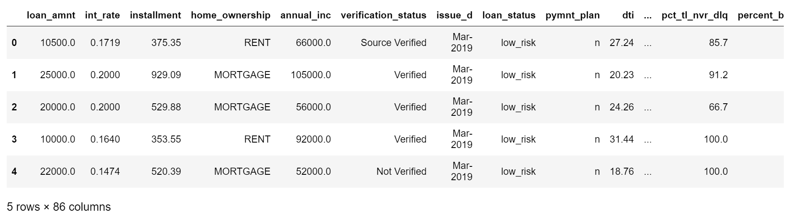
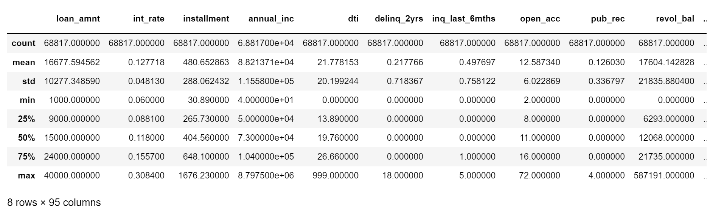
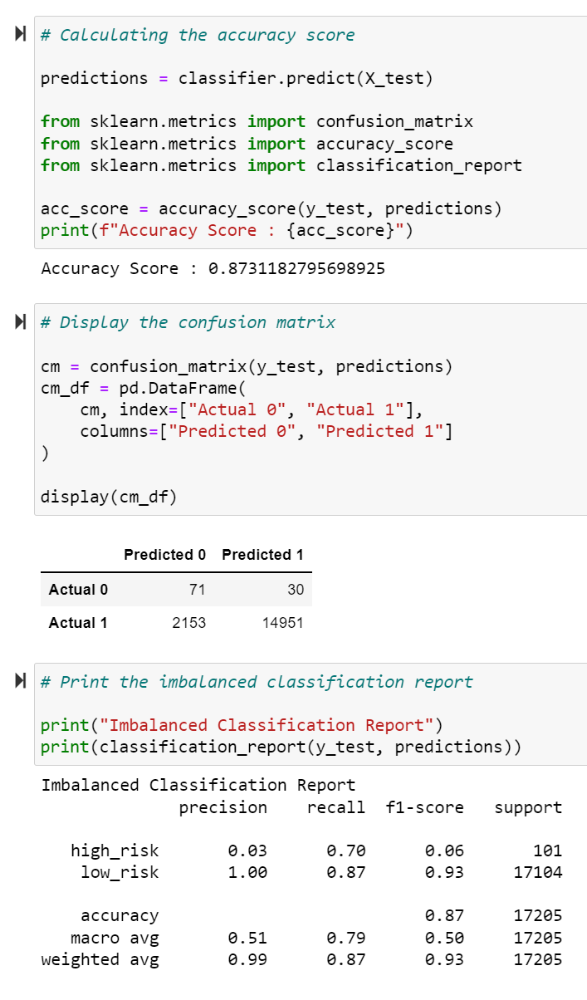

# Credit_Risk_Analysis

Linear regressions and random forest models were created to predict possible credit defaults with known data.

# Overview

In using several models, an effective predictive model was created to predict whether a customers credit is low or high.

# Results

## Cleaned Data

## Testing/ Training Split

## Confusion Matrix Model

# Credit Risk Resampling

## Random Oversampling

- Balanced Accuracy: 65.7%

- Recall: Low Risk= 60% High Risk= 71%

- Precision: Low Risk= 99.99% High Risk= 1%

## SMOTE Oversampling

- Balanced Accuracy: 66.2%

- Recall: Low Risk= 63% High Risk= 69%

- Precision: Low Risk= 99.99% High Risk= 1%

## Undersampling

- Balanced Accuracy: 54.4%

- Recall: Low Risk= 40% High Risk= 69%

- Precision: Low Risk= 99.99% High Risk= 1%

## Combination Sampling

- Balanced Accuracy: 69%

- Recall: Low Risk= 57% High Risk= 80%

- Precision: Low Risk= 99.99% High Risk= 1%

# Credit Risk Ensemble

## Random Forest

- Balanced Accuracy: 87.3%

- Recall: Low Risk= 87% High Risk= 70%

- Precision: Low Risk= 99.99% High Risk= 3%

## AdaBoost CLassifier

- Balanced Accuracy: 94.2%

- Recall: Low Risk= 94% High Risk= 92%

- Precision: Low Risk= 99.99% High Risk= 9%

# Summary

The prediction of high risk customers was the best in comparison to other models in using the Easy Ensemble AdaBoost Classifier model. I do however, recommend using Naive Bayes model with the given data, due to the data being imbalanced.
